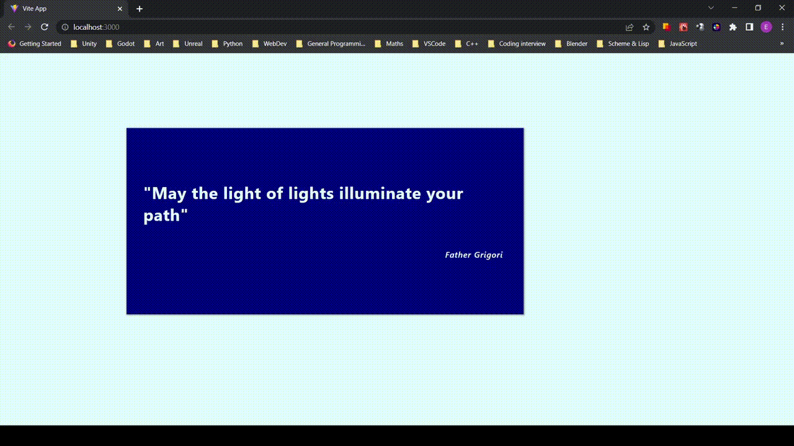

# React Draggable Modal

A simple draggable modal component for React, written in TypeScript.

## Instructions

Run `yarn install` to grab install all project dependencies, and then `yarn dev` to start the
development server.

